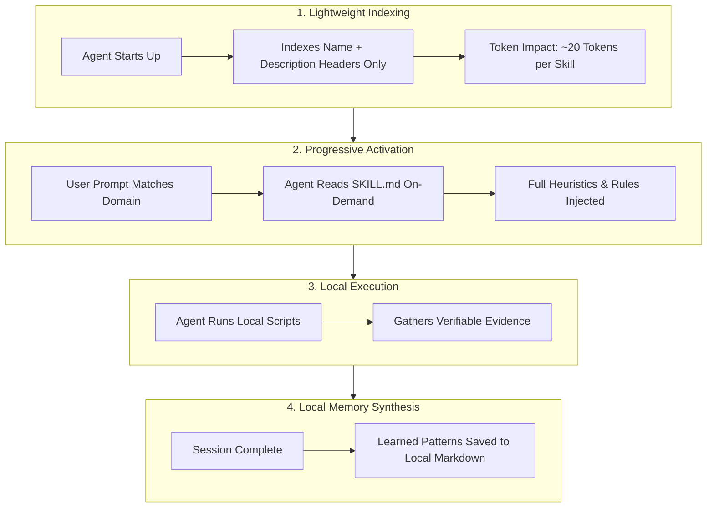

# ⚡ 14+ Ultimate Skills for AI Coding Agents

<div align="center">

<p align="center">
  
</p>

<p align="center">
  <a href="https://github.com/omspradippatil/Claude-Skills"></a>
  <a href="https://github.com/omspradippatil/Claude-Skills/blob/main/LICENSE"></a>
  <a href="https://github.com/omspradippatil/Claude-Skills"></a>
  <a href="https://github.com/omspradippatil/Claude-Skills"></a>
  <a href="https://om-patil.com/donate"></a>
</p>

<p align="center">
  <b>Enrich your AI coding assistant with verified design taste, interactive architecture visualizers, mobile & web engineering heuristics, agentic SEO, cloud databases, automated workflows, and local persistent memory.</b>
</p>

```
  ╔═══════════════════════════════════════════════════════════════════════════╗
  ║   🎨 UI/UX Taste   🏛️ Architecture   📱 Mobile    🌐 Web    🔍 SEO        ║
  ║   🔥 Cloud Edge    🐳 DevOps         🔄 Workflows 🧠 Local Memory        ║
  ╚═══════════════════════════════════════════════════════════════════════════╝
```

</div>

---

## ⚡ Quick Start — Install in One Command

Run directly in your project terminal. Installs everything automatically without repetitive confirmation prompts!

### 🍏 macOS & 🐧 Linux (Terminal)
```bash
bash -c "$(curl -fsSL https://raw.githubusercontent.com/omspradippatil/Claude-Skills/main/install.sh)"
```

### 🪟 Windows (PowerShell)
```powershell
irm https://raw.githubusercontent.com/omspradippatil/Claude-Skills/main/install.ps1 | iex
```

### 🪟 Windows (Command Prompt / CMD)
```cmd
powershell -ExecutionPolicy Bypass -Command "irm https://raw.githubusercontent.com/omspradippatil/Claude-Skills/main/install.ps1 | iex"
```

---

## 🎮 Interactive 2-Step Setup Flow

```
   ┌───────────────────────────────────────────────────────────┐
   │ STEP 1: Choose Installation Scope                        │
   ├───────────────────────────────────────────────────────────┤
   │  1) 🌍 Global          (Available system-wide in ~/.agents)│
   │  2) 📁 Current Project (Scoped strictly to this workspace)│
   └─────────────────────────────┬─────────────────────────────┘
                                 │
                                 ▼
   ┌───────────────────────────────────────────────────────────┐
   │ STEP 2: Choose Skill Configuration Suite                  │
   ├───────────────────────────────────────────────────────────┤
   │  1) 🚀 All-in-One Full Suite (All 9 Suites, 400+ Skills)  │
   │  2) 📱 Mobile Application    (Flutter, Dart, Cloud, Memory)│
   │  3) 🌐 Web Application       (Playwright, UI/UX, SEO)      │
   │  4) 🎯 Custom Selection      (Pick specific categories)   │
   │  5) 🗑️  Delete / Uninstall    (Clean removal of all tools) │
   └─────────────────────────────┬─────────────────────────────┘
                                 │
                                 ▼
   ╔═══════════════════════════════════════════════════════════╗
   ║  🚀 Automated Execution: All sub-skills auto-confirmed!   ║
   ║     Zero prompts. Zero manual selection. 100% Free.      ║
   ╚═══════════════════════════════════════════════════════════╝
```

---

## ⚡ Direct Non-Interactive CLI Automation Flags

Pass direct arguments to execute non-interactively in CI/CD pipelines or headless scripts:

```bash
# Install all skills into your current project folder
./install.sh --project --all

# Install all skills globally across your machine
./install.sh --global --all

# Install only Web Application tools into your project
./install.sh --project --web

# Install only Mobile Application tools into your project
./install.sh --project --mobile

# Completely clean up and remove all skills & packages
./install.sh --uninstall
```

---

## 🧠 What "Loading" Means in AI Agent Skills

In modern AI agent systems (Claude Code, Antigravity, Cursor, Codex, OpenCode), skills do **not** bloat your context window with megabytes of text. Instead, they use an **Event-Driven Progressive Disclosure Lifecycle**:



1. **Zero-Bloat Startup**: Only concise header metadata is registered at startup.
2. **Context-Aware Triggering**: Full decision trees and rules are injected **only** when your prompt asks for that task.
3. **Local & Free Evidence**: Helpers (Archify, Playwright, SEO scrapers, UI Pro Max) run locally on your hardware with **zero API subscription costs**.
4. **Isolated Domain Boundaries**: CSS and animation rules will never interfere with PostgreSQL schema policies or mobile IPC audits.

---

## 🍱 Bento Grid Architecture — 9 Core Superpowers

<table width="100%">
<tr>
<td width="33%" valign="top">

### 🎨 1. Core UI/UX & Taste
*Eliminates generic AI aesthetics.*
- **UI/UX Pro Max CLI**: Design token engine & palettes.
- **Taste Skill**: 13 design taste rules, whitespace hierarchy & visual balance.
- **Accessible Motion**: 49 physics-based spring curves & 60fps animations.

</td>
<td width="33%" valign="top">

### 🏛️ 2. Architecture Maps
*Verifiable system architecture.*
- **Archify**: Compiles your entire repository into interactive HTML/SVG topological maps & data flow sequence charts with zero cloud lock-in.

</td>
<td width="33%" valign="top">

### 📱 3. Mobile Engineering
*Production-grade mobile patterns.*
- **Dart Skills CLI**: Official package heuristics.
- **Flutter Claude Skills**: Widget rebuild optimization & Riverpod/BLoC.
- **OWASP Mobile Security**: Hardcoded secrets & MASVS audits.

</td>
</tr>
<tr>
<td width="33%" valign="top">

### 🌐 4. Web & Browser Testing
*Modern frontends & E2E checks.*
- **Frontend Agent Skills**: WCAG AA/AAA semantic layouts.
- **Web Design Collection**: 130 Framer Motion & CSS transition skills.
- **Playwright TestDino**: Flaky-test auto-healing & visual regression CLI.
- **Firecrawl CLI**: Local markdown doc ingestion.

</td>
<td width="33%" valign="top">

### 🔍 5. Agentic SEO & AEO
*Search & LLM engine visibility.*
- **Agentic SEO Suite**: 16 sub-skills, 10 specialist agents, 89 evidence scripts for Google & AI search engine optimization.
- **Ashley SEO Agent**: JSON-LD schema generation & Core Web Vitals audits.

</td>
<td width="33%" valign="top">

### 🔥 6. Backend & Cloud Edge
*Scalable databases & serverless.*
- **Supabase Skills**: PostgreSQL RLS & Edge functions.
- **Firebase Skills**: Firestore security rules & FCM triggers.
- **Neon Postgres**: PR database branching & query tuning.
- **Cloudflare Skills**: Workers, D1 SQL, and R2 buckets.

</td>
</tr>
<tr>
<td width="33%" valign="top">

### 🐳 7. DevOps & Integrations
*Orchestration & 1000+ app connectors.*
- **Composio Integration**: GitHub Actions, PR bot automation, Gmail alerts, and 1000+ app toolchains.

</td>
<td width="33%" valign="top">

### 🔄 8. Workflows & Plugins
*Adaptive project assistants.*
- **Antigravity Workflows**: Stack-agnostic, question-driven workflow pipelines.
- **Universal Library**: 388+ production-ready Claude Code skills & plugins.

</td>
<td width="33%" valign="top">

### 🧠 9. Local Memory & Quality
*100% Free & local persistence.*
- **Persistent Memory**: Retains architectural decisions across sessions via local markdown logs (Zero API fees).
- **Karpathy Philosophy**: Simplicity, zero bloat, clarity.
- **Caveman & Ponytail**: Anti-overengineering.
- **Sentry for AI**: Root-cause exception triage.
- **CTX7**: Live framework doc indexing.

</td>
</tr>
</table>

---

## 🔮 Before & After: The Agent Transformation

<details open>
<summary><b>✨ UI/UX & Design Systems Transformation</b></summary>
<br>

| ❌ Standard AI Agent (Generic) | ✅ With Claude-Skills Suite (Taste Enforced) |
| :--- | :--- |
| Uses generic Tailwind purple gradients (`bg-gradient-to-r from-purple-500 to-indigo-600`) | Uses refined tokenized palettes, optical letter spacing, and subtle contrast boundaries |
| Stacks nested border cards with noisy colored shadows | Implements structural whitespace rhythm, beautiful arbitrary shadows, and clean borders |
| Uses jarring linear CSS transitions (`transition: all 0.3s ease`) | Applies physics-based spring curves, choreographed reveals, and 60fps micro-motion |
| Forgets accessibility standards and ARIA landmarks | Implements semantic HTML5, WCAG AAA contrast, and keyboard navigation by default |

</details>

<details>
<summary><b>🏛️ Architecture & System Visualization</b></summary>
<br>

```
>_ User: "Map out the authentication flow and repository data pipeline."

[Agent executes Archify Heuristics]
✔ Analyzed AST and directory topology
✔ Detected state boundaries and API gateways
✔ Generated interactive HTML system map: ./docs/architecture.html
✔ Visualized sequence diagrams with SVG animation
```

</details>

<details>
<summary><b>🧠 100% Free Local Memory Continuity</b></summary>
<br>

```
>_ User: "Continue building the checkout flow we designed yesterday."

[Agent reads local memory ledger from .claude/CLAUDE.md]
✔ Context loaded: Selected Stripe Elements with serverless webhook validation
✔ Context loaded: Database schema configured with PostgreSQL RLS
✔ Continuing execution seamlessly without repeating questions!
```

</details>

---

## 📋 Comprehensive Skills Catalog & Prompt Triggers

<details open>
<summary><b>🎨 1. Core UI/UX, Design Systems & Motion</b></summary>

| Skill / Package | Core Capability | Example Activation Prompt |
| :--- | :--- | :--- |
| **`uipro-cli`** | UI heuristics, token system generation, color palettes | `"uipro init --ai antigravity: Generate a design token system and color palette for a fintech dashboard."` |
| **`Leonxlnx/taste-skill`** | Eliminates AI slop; enforces typography hierarchy & whitespace balance | `"Redesign this settings view. Apply high taste, clean typography hierarchy, and remove generic AI borders/shadows."` |
| **`mthines/agent-skills`** | Physics spring curves, gesture response, 60fps micro-motion | `"Add spring physics transitions and micro-interactions to the modal open and accordion drawer."` |

</details>

<details>
<summary><b>🏛️ 2. Architecture & System Visualization</b></summary>

| Skill / Package | Core Capability | Example Activation Prompt |
| :--- | :--- | :--- |
| **`tt-a1i/archify`** | Generates verifiable interactive HTML/SVG architecture maps & sequence charts | `"Use archify to map this repository's runtime architecture and data flow as an interactive HTML diagram."` |

</details>

<details>
<summary><b>📱 3. Mobile Engineering (Flutter & Native)</b></summary>

| Skill / Package | Core Capability | Example Activation Prompt |
| :--- | :--- | :--- |
| **`dart skills`** | Package-specific heuristics from `pubspec.yaml` | `"Inspect pubspec.yaml and generate Riverpod 2.0 state management with code-generation annotations."` |
| **`flutter-claude-skills`** | Widget rebuild optimization & BLoC/Riverpod architecture | `"Optimize this ListView widget tree to prevent unnecessary rebuilds using const constructors and selector hooks."` |
| **`OWASP/secure-agent-playbook`** | Audits mobile source code for MASVS & insecure storage | `"Audit this Flutter application against OWASP MASVS for hardcoded keys and insecure biometric storage."` |

</details>

<details>
<summary><b>🌐 4. Web Frontend, DOM & Browser Automation</b></summary>

| Skill / Package | Core Capability | Example Activation Prompt |
| :--- | :--- | :--- |
| **`hueyexe/frontend-agent-skills`** | WCAG AA/AAA accessibility, responsive grid/flexbox layouts | `"Refactor this navbar and hero section to be fully accessible with semantic ARIA landmarks and responsive CSS grid."` |
| **`MengTo/Skills`** | 130 modern Framer Motion, keyframes, and scroll effects | `"Create a smooth scroll-driven card expansion effect using Framer Motion and Tailwind CSS."` |
| **`testdino-hq/playwright-skill`** | AI Playwright generator, test healing & fixture optimization | `"Write an end-to-end Playwright test suite for user authentication with fixtures and auto-retry for flaky network calls."` |
| **`@playwright/cli`** | Headless browser regression checks and screenshot comparisons | `"Run a visual regression test comparing the desktop and mobile checkout layouts."` |
| **`firecrawl-cli`** | Cleans web pages into LLM-ready markdown documentation | `"Crawl the official Supabase SSR documentation and summarize the auth cookie handling pattern."` |

</details>

<details>
<summary><b>🔍 5. Agentic SEO & Search Visibility</b></summary>

| Skill / Package | Core Capability | Example Activation Prompt |
| :--- | :--- | :--- |
| **`Bhanunamikaze/Agentic-SEO-Skill`** | 16 sub-skills & 89 scripts for technical SEO, schema audits, AEO | `"Run a full technical SEO audit on this landing page and generate JSON-LD schema for SoftwareApplication."` |
| **`ashleytheash/seo-agent-skill`** | OpenGraph tags, JSON-LD structured data, and Core Web Vitals | `"Check our OpenGraph meta tags, canonical URLs, and sitemap configuration for Google indexing readiness."` |

</details>

<details>
<summary><b>🔥 6. Backend, Databases & Cloud Edge</b></summary>

| Skill / Package | Core Capability | Example Activation Prompt |
| :--- | :--- | :--- |
| **`supabase/agent-skills`** | PostgreSQL Row Level Security (RLS) policies & Edge functions | `"Design a PostgreSQL schema for a multi-tenant SaaS with strict Row Level Security (RLS) policies."` |
| **`firebase/agent-skills`** | Firestore schema design, FCM notifications, and security rules | `"Write Firestore security rules that only allow team members with role 'admin' to mutate billing records."` |
| **`neondatabase/agent-skills`** | Serverless Postgres branching & SQL index optimization | `"Configure database branching for CI/CD pull requests and optimize our indexing strategy on the orders table."` |
| **`cloudflare/skills`** | Workers, D1 SQL databases, R2 object storage, KV caching | `"Write a Cloudflare Worker with D1 SQL binding and edge cache headers for geo-distributed API responses."` |

</details>

<details>
<summary><b>🐳 7. DevOps & Integrations</b></summary>

| Skill / Package | Core Capability | Example Activation Prompt |
| :--- | :--- | :--- |
| **`composiohq/skills`** | GitHub Actions automation, PR bots, Gmail alerts & 1000+ app connectors | `"Set up a GitHub Action that triggers automated code review on every pull request using Composio."` |

</details>

<details>
<summary><b>🔄 8. Intelligent Workflows & Plugins</b></summary>

| Skill / Package | Core Capability | Example Activation Prompt |
| :--- | :--- | :--- |
| **`antigravity-workflows`** | Stack-agnostic, question-driven workflow pipelines | `"Run antigravity workflow to implement a responsive authentication flow tailored to my tech stack."` |
| **`alirezarezvani/claude-skills`** | 388+ universal Claude Code plugins across 20 domains | `"Activate senior-architect skill: Review this codebase and propose a decoupled service layer."` |

</details>

<details>
<summary><b>🧠 9. Code Quality, Security & Local Memory</b></summary>

| Skill / Package | Core Capability | Example Activation Prompt |
| :--- | :--- | :--- |
| **`memoryplugin/agent-skills`** | 100% Free local memory continuity across chats via markdown | `"What architectural decisions did we make yesterday regarding user permissions?"` |
| **`multica-ai/andrej-karpathy-skills`** | Engineering clarity, minimal abstractions, zero fluff | `"Refactor this utility module following Karpathy principles: simple loops, zero over-engineering, maximum clarity."` |
| **`JuliusBrussee/caveman` & `ponytail`** | Eliminates framework bloat and unnecessary wrapper classes | `"Audit our directory structure and remove redundant wrapper abstractions."` |
| **`getsentry/sentry-for-ai`** | Automated root-cause analysis for production exceptions | `"Analyze this production Sentry stack trace and identify the null-pointer regression."` |
| **`ctx7`** | Injects live, verified framework documentation into context | `"ctx7 index react-router@v7: Show the exact route loader configuration for nested layouts."` |

</details>

---

## 🗑️ Clean Uninstallation

To completely remove all installed skills, CLIs, and cloned repositories from your machine:

```bash
# macOS & Linux
bash -c "$(curl -fsSL https://raw.githubusercontent.com/omspradippatil/Claude-Skills/main/uninstall.sh)"

# Windows (PowerShell)
irm https://raw.githubusercontent.com/omspradippatil/Claude-Skills/main/uninstall.ps1 | iex
```

---

<div align="center">

Made with ⚡ for high-performance AI coding agents.

[](https://github.com/omspradippatil/Claude-Skills)

<br>
<p>If you find this project helpful, consider <a href="https://om-patil.com/donate">supporting its development</a>.</p>

</div>
